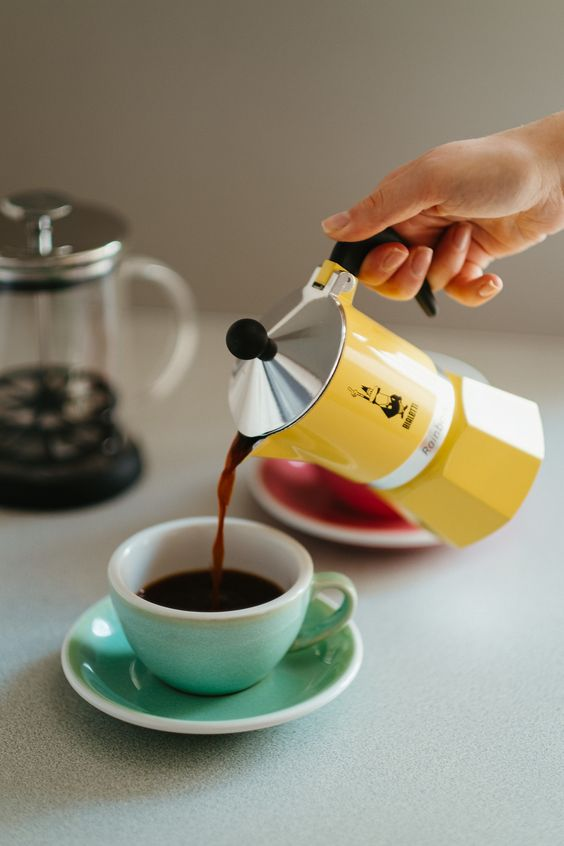
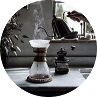

<h1 align="center">
The Coffee Filter

  
# *Introduction* 
The Coffee Filter: Where the art of coffee meets digital elegance. In a world where coffee is not just a beverage but a journey of flavors, sensations, and stories, "The Coffee Filter" emerges as the digital beacon for all aficionados. It’s not just an app; it's a curated experience, weaving together the rich tapestry of specialty coffee culture with cutting-edge technology. Dive into a universe where every sip resonates with quality, every cafe tells a story, and every search is a step closer to your next favorite brew. Designed with passion and brewed to perfection, "The Coffee Filter" promises to elevate your coffee journey, one discovery at a time.

# *Description of the project* 
Discover a world beyond the ordinary with The Coffee Filter. As the premier mobile application for specialty coffee enthusiasts, we have meticulously crafted a space where distinction meets accessibility. Whether you’re a seasoned barista, a sibarita in search of new flavors, or just embarking on your specialty coffee journey, our platform caters to all.

Navigate through an expertly curated list of cafes, each resonating with its unique tale and commitment to the craft. Our rigorous verification and approval process ensures that every cafe listed meets the highest standards of quality, offering you an unadulterated coffee experience. With intuitive filters, detailed profiles, and real-time user reviews, finding your next coffee haven has never been easier or more delightful.

Join us in redefining the coffee narrative, one cup at a time. With The Coffee Filter, every moment is an exploration, every cafe a story, and every cup a masterpiece.

# *Functionalities* 
 - **Specialty Café Locator:** Quickly find specialty cafés in your chosen city.

 - **Curated Listings:** Cafés undergo an approval process to ensure they meet high standards.

 - **Detailed Café Profiles:** Information about the café's address, operation hours, and description is available.

 - **User Filters:** Users can refine their search based on specific criteria such as city.

 - **Admin Verification:** A backend system for café suggestions to be reviewed and approved by administrators.

# *How users can use it* 
In order to visualize the frontend part of this project properly you need react and axios installed. 
First of all please clone the repository:
 - https://github.com/Anais-RV/TheCoffeeFilter_Front    

You can run the project with:
  
        npm start
Run the following command to install all the required dependencies for the project:

        npm install
To start the development server, use the following command:
        
        npm run dev
To display it in the browser, open your local host:
  
        http://localhost:5173

The page will automatically reload if you make changes to the code. 
You will see the build errors and lint warnings in the console. 

--------------------------------------------------------------
In order to visualize the backend part of this project properly you need PHP and laravel installed. 
First of all please clone the repository:
 - https://github.com/Anais-RV/TheCoffeeFilter_Back  

Run the following command to install all the required dependencies for the project:

        composer install
To start the Laravel development server, use:

        php artisan serve
The backend will be accessible at http://127.0.0.1:8000 (or your localhost).

# *Learn more about React*  
You can find detailed instructions on using Create React App and many tips in [its documentation](https://create-react-app.dev/). 

# *Learn more about Laravel*  
Laravel is a web application framework with expressive, elegant syntax. We believe development must be an enjoyable and creative experience to be truly fulfilling. Laravel takes the pain out of development by easing common tasks used in many web projects, such as:

- [Simple, fast routing engine](https://laravel.com/docs/routing).
- [Powerful dependency injection container](https://laravel.com/docs/container).
- Multiple back-ends for [session](https://laravel.com/docs/session) and [cache](https://laravel.com/docs/cache) storage.
- Expressive, intuitive [database ORM](https://laravel.com/docs/eloquent).
- Database agnostic [schema migrations](https://laravel.com/docs/migrations).
- [Robust background job processing](https://laravel.com/docs/queues).
- [Real-time event broadcasting](https://laravel.com/docs/broadcasting).

Laravel is accessible, powerful, and provides tools required for large, robust applications.
Laravel has the most extensive and thorough documentation and video tutorial library of all modern web application frameworks, making it a breeze to get started with the framework.

You may also try the Laravel Bootcamp, where you will be guided through building a modern Laravel application from scratch.

If you don't feel like reading, Laracasts can help. Laracasts contains over 2000 video tutorials on a range of topics including Laravel, modern PHP, unit testing, and JavaScript. Boost your skills by digging into our comprehensive video library. 

# *Technologies used*  

       

 